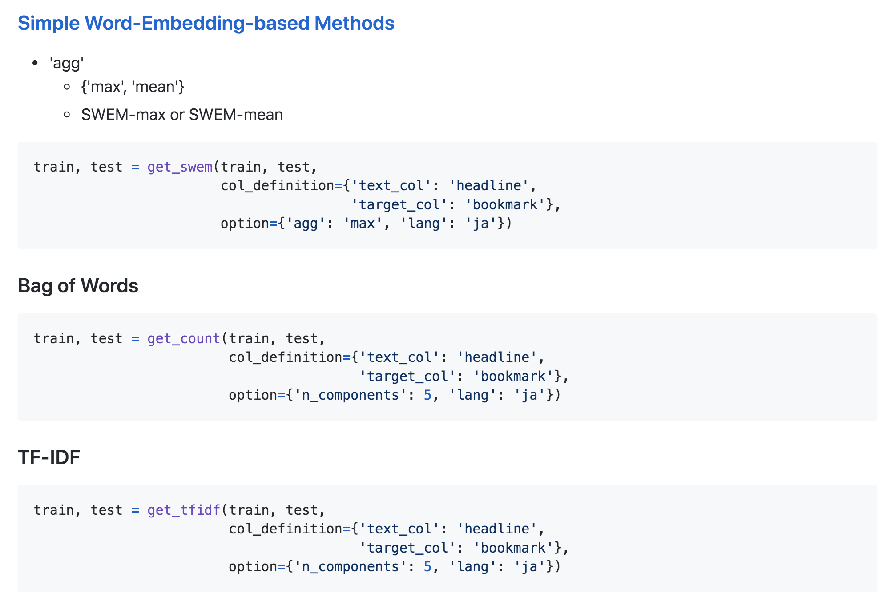

<style>
h1 {
  font-size: 70px;
  color: #003E70;
}
</style>

# NLPコンペの知見を実務に活かすために

u++ (@upura0)
Kaggle Google Quest Q&A Labeling 反省会
2020年02月28日

---

# 本発表について

- 資料は公開済です(https://speakerdeck.com/upura)
- 「会場だけ」の情報もあります
- 「会場だけ」を除き、SNS・ブログでの言及もOK

## 目次

1. コンペと実務
1. 自作ライブラリ「Ayniy」
1. （会場だけ）実例

---

# 自己紹介

- 事業会社のデータサイエンティスト
  - 法人向けデータ分析組織立ち上げ
  - サービス企画・開発など
- Kaggle
  - Kaggle Master ([profile](https://www.kaggle.com/sishihara))
  - [PetFinder.my Adoption Prediction](https://www.kaggle.com/c/petfinder-adoption-prediction) コンペ優勝
  - 『[Kaggleに登録したら次にやること ～ これだけやれば十分闘える！Titanicの先へ行く入門 10 Kernel ～](https://qiita.com/upura/items/3c10ff6fed4e7c3d70f0)』
  - 『[PythonではじめるKaggleスタートブック](https://www.amazon.co.jp/dp/4065190061)』
  - [Weekly Kaggle News](https://www.getrevue.co/profile/upura)

---
<!-- _class: invert -->
# 1.コンペと実務

---
# コンペと実務

- コンペで得た知見を実務に還元できれば最高
- 知見を活かしやすいよう、コンペと実務で共通の自作ライブラリを使っている
- 課題：
  - コンペ特化の複雑なpipelineは、実務だと逆に使いづらい
  - コンペでは英語が多いが、実務では日本語が多い

---
<!-- _class: invert -->
# 2.自作ライブラリ「Ayniy」

---
# Ayniy

- コンペでも実務でも使っている自作ライブラリ
- 「よくある処理」を共通インターフェースで手軽に
- 日本語＆英語の自然言語処理にも対応

---
# Ayniy?

>サドリディン・アイニー（1878年4月15日 - 1954年7月15日）は、ソビエト連邦タジク共和国（現:タジキスタン）の作家、ウラマー。タジク語による著述活動を行い、ソビエト連邦ではタジク・ソビエト文学の創始者として高い評価を受けた。

<!-- _footer: "https://uz.wikipedia.org/wiki/Sadriddin_Ayniy" -->

---
# 設計思想

```python
train, test = PROCESSING(train: pd.DataFrame,
                         test: pd.DataFrame,
                         col_definition: dict,
                         option: dict)
```

---
# 日本語・英語の切り替え



---
# 共通インターフェース

- config.yamlの設定がしやすい
- All you need is yaml

```
col_definition:
  id_col: 'PetID'
  target_col: 'AdoptionSpeed'
  numerical_col: [
    'Age',
  ]
  categorical_col: [
    'Type',
  ]
  text_col: [
    'Description',
  ]
```

---
<!-- _class: invert -->
# 3.（会場だけ）実例

---
<!-- _class: invert -->
# まとめ

---
# まとめ

- コンペの知見を実務で活かすための自作ライブラリ「Ayniy」を紹介
- 「Google Quest Q&A Labeling」で得られた知見も、実務で活用していきたい
